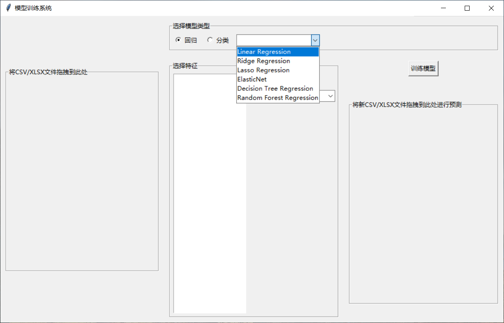
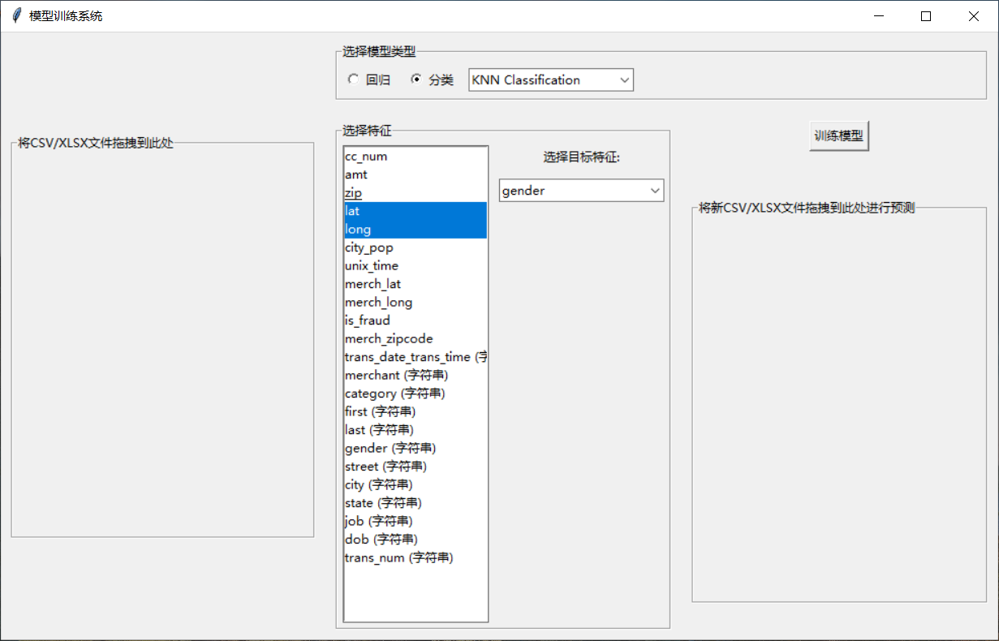
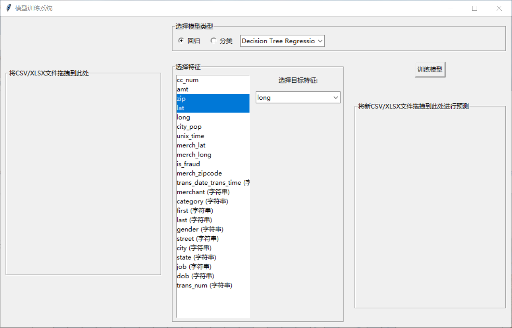
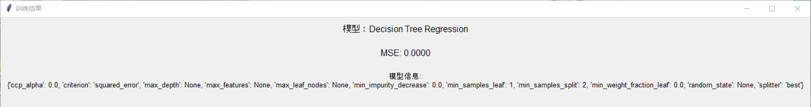
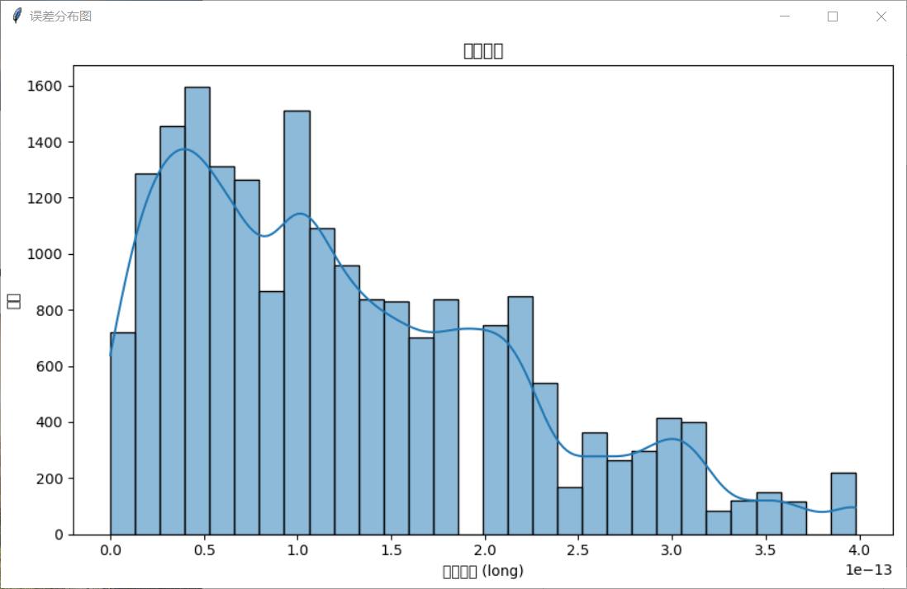
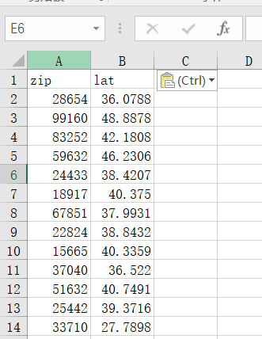
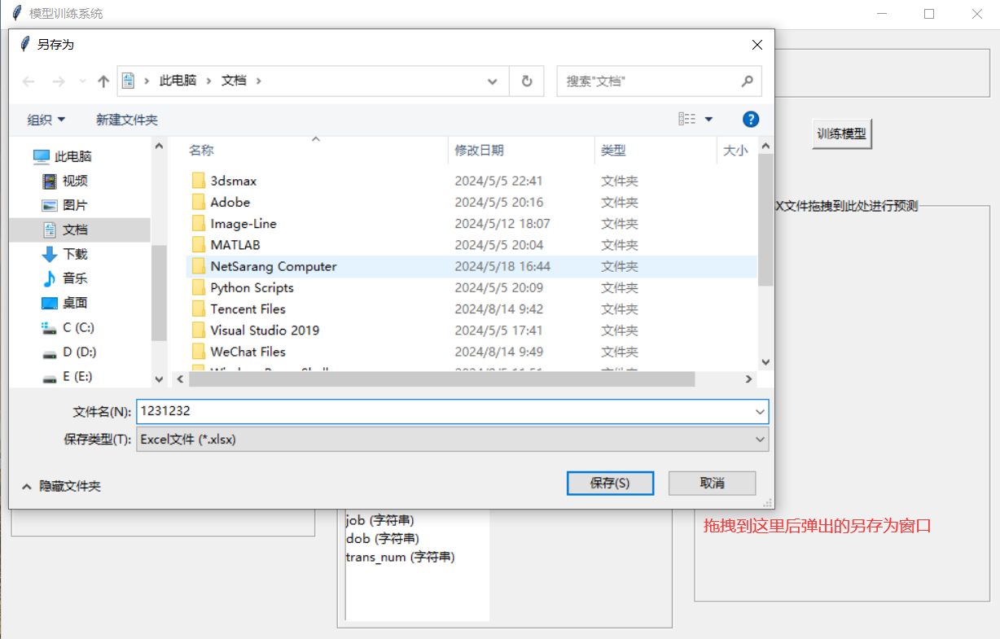
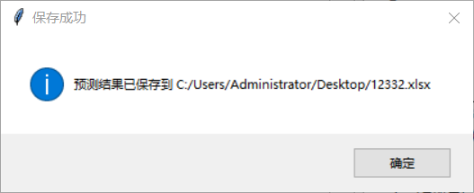
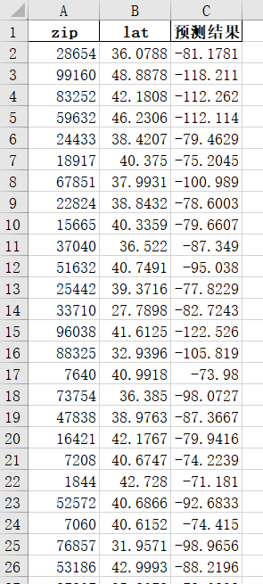

#### 你可以使用回归模型，用于连续值的预测

#### 选好模型后，左侧选预测特征，右侧选被预测的特征

#### 也可以使用分类模型，用于分类

#### 训练结束后的MSE信息和模型的其他属性的信息

#### 误差分布图，横坐标是误差的具体值，纵坐标是分布于对应横坐标区间的误差值个数

#### 新建一个xlsx文件，准备好特征对应的数据

#### 拖拽后会弹出另存为窗口

#### 保存成功

#### 查看

